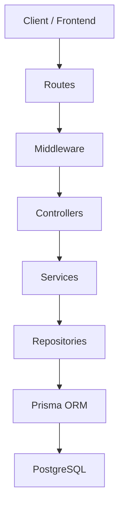
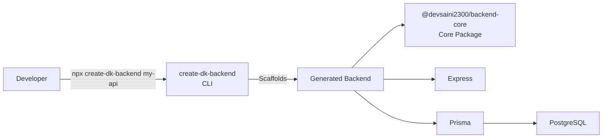
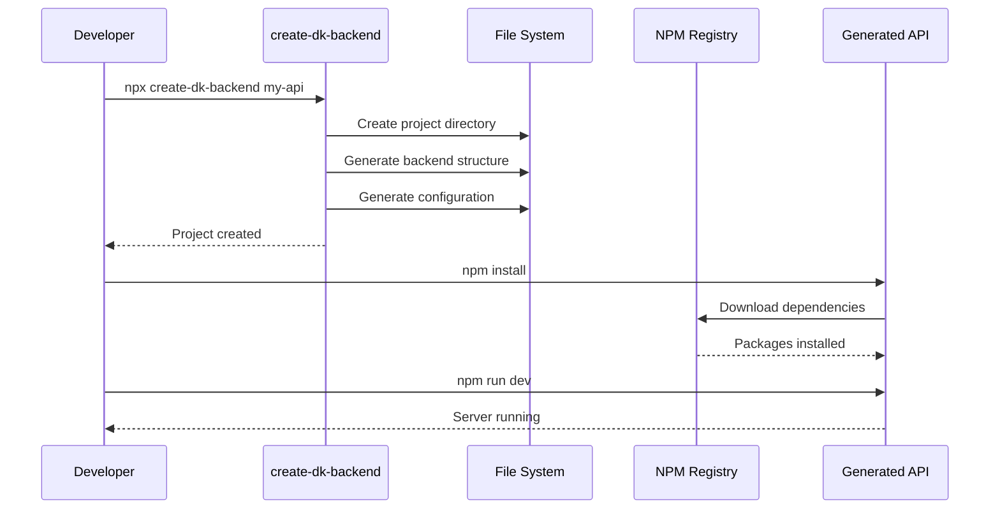
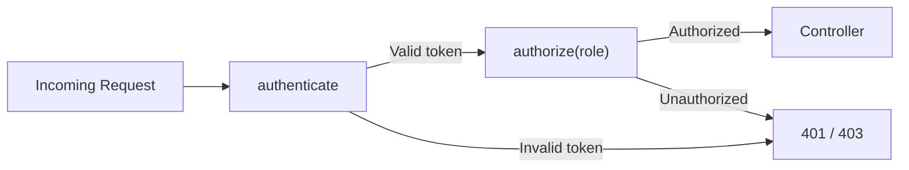
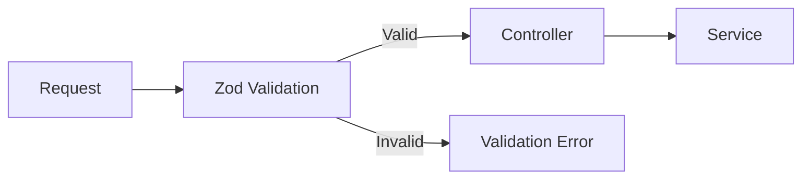
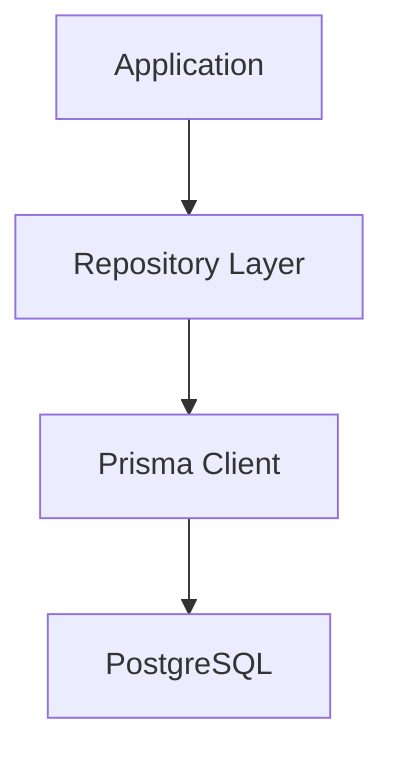
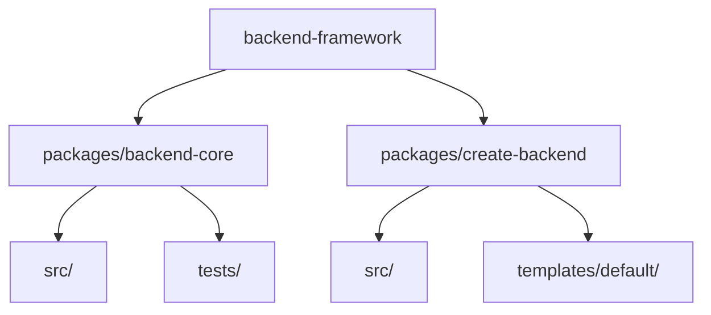

# 🚀 Backend Framework

### Production-ready TypeScript backend infrastructure with authentication, authorization, validation, Prisma, PostgreSQL, security, and CLI scaffolding.

[](https://www.npmjs.com/package/@devsaini2300/backend-core)
[](https://www.npmjs.com/package/create-dk-backend)
[](https://nodejs.org/)
[](https://www.typescriptlang.org/)
[](LICENSE)

> Build production-ready Node.js backends in seconds instead of starting from scratch.

---

## 📖 Overview

**Backend Framework** is a reusable TypeScript backend ecosystem designed to provide a clean, secure, and scalable foundation for Node.js applications.

Instead of repeatedly implementing authentication, JWT handling, password hashing, validation, error handling, logging, database configuration, and project structure, developers can generate a complete backend project with:

```bash
npx create-dk-backend my-api
```

The framework is organized as an npm-workspaces monorepo containing two packages:

| Package                      | Purpose                             |
| ---------------------------- | ----------------------------------- |
| `@devsaini2300/backend-core` | Reusable backend infrastructure     |
| `create-dk-backend`          | CLI for generating backend projects |

---

# 🏗️ Architecture

The framework follows a layered backend architecture that separates HTTP handling, business logic, data access, and infrastructure.



### Request lifecycle

```text
Client
  ↓
Route
  ↓
Middleware
  ↓
Controller
  ↓
Service
  ↓
Repository
  ↓
Prisma
  ↓
PostgreSQL
```

This separation makes the generated applications easier to:

* maintain
* test
* extend
* debug
* scale

---

# 📦 Package Architecture

The project is structured as an npm monorepo.



### Package responsibilities

#### `@devsaini2300/backend-core`

Provides reusable backend infrastructure:

* JWT access tokens
* JWT refresh tokens
* Authentication middleware
* Role-based authorization
* Password hashing
* Password comparison
* Zod validation
* Error handling
* Async handlers
* Standard API responses
* Pino logging

#### `create-dk-backend`

Provides the developer-facing CLI responsible for:

* creating the project directory
* generating the backend structure
* configuring dependencies
* configuring authentication
* configuring Prisma
* generating environment configuration
* generating Docker configuration
* providing development scripts

---

# ⚡ Quick Start

The fastest way to create a backend:

```bash
npx create-dk-backend my-api
```

Enter the project:

```bash
cd my-api
```

Install dependencies:

```bash
npm install
```

Create the environment file:

```bash
cp .env.example .env
```

Configure your PostgreSQL database and JWT secrets in `.env`.

Generate Prisma Client:

```bash
npm run db:generate
```

Run migrations:

```bash
npm run db:migrate
```

Start development:

```bash
npm run dev
```

Your server will run at:

```text
http://localhost:5000
```

---

# 🔄 CLI Generation Flow



---

# ✨ Features

## 🔐 Authentication

The framework provides production-oriented authentication utilities.

### JWT

* Access tokens
* Refresh tokens
* Token expiration
* Secure verification
* JWT algorithm restrictions
* Environment-based secrets

Example:

```typescript
import {
  generateAccessToken,
  verifyAccessToken,
} from "@devsaini2300/backend-core";

const token = generateAccessToken({
  userId: user.id,
  role: user.role,
});

const payload = verifyAccessToken(token);
```

---

# 👤 Authorization / RBAC

Protect routes based on user roles.

```typescript
router.delete(
  "/users/:id",
  authenticate,
  authorize("ADMIN"),
  deleteUserController
);
```

The authorization layer remains separate from authentication.



---

# 🔑 Password Security

Passwords are never stored as plain text.

The core package provides:

```typescript
import {
  hashPassword,
  comparePassword,
} from "@devsaini2300/backend-core";
```

Hash:

```typescript
const hashedPassword = await hashPassword(password);
```

Compare:

```typescript
const valid = await comparePassword(
  password,
  hashedPassword
);
```

---

# 🛡️ Validation

Request validation uses Zod.

Example:

```typescript
router.post(
  "/register",
  validate(registerSchema),
  registerController
);
```

This prevents validation logic from being mixed with business logic.



---

# ❌ Centralized Error Handling

The framework provides:

* `AppError`
* `errorHandler`
* `notFoundHandler`
* `asyncHandler`

Example:

```typescript
throw new AppError(
  "User not found",
  404
);
```

Async handlers:

```typescript
asyncHandler(async (req, res) => {
  // controller logic
});
```

This keeps error handling consistent across the application.

---

# 📡 Standard API Responses

The framework provides response helpers:

```typescript
sendSuccess(res, data);
```

and:

```typescript
sendError(res, error);
```

This helps maintain consistent API response structures.

---

# 🗄️ Database

Generated projects use:

* PostgreSQL
* Prisma ORM
* Prisma Client
* Prisma migrations

Generate Prisma Client:

```bash
npm run db:generate
```

Run migrations:

```bash
npm run db:migrate
```

Push schema changes:

```bash
npm run db:push
```

Open Prisma Studio:

```bash
npm run db:studio
```

Architecture:



---

# 🐳 Docker

Generated projects include Docker configuration.

Start services:

```bash
docker compose up -d
```

Stop services:

```bash
docker compose down
```

This allows developers to create a consistent local development environment.

---

# 📁 Generated Project Structure

Running:

```bash
npx create-dk-backend my-api
```

generates a structure similar to:

```text
my-api/
│
├── prisma/
│   └── schema.prisma
│
├── src/
│   ├── controllers/
│   │
│   ├── middleware/
│   │   ├── auth.middleware.ts
│   │   ├── error.middleware.ts
│   │   ├── not-found.middleware.ts
│   │   └── role.middleware.ts
│   │
│   ├── repositories/
│   │   └── user.repository.ts
│   │
│   ├── routes/
│   │   ├── auth.routes.ts
│   │   └── index.ts
│   │
│   ├── services/
│   │   └── auth.service.ts
│   │
│   ├── types/
│   │   └── express.d.ts
│   │
│   ├── utils/
│   │   ├── async-handler.ts
│   │   ├── jwt.ts
│   │   ├── password.ts
│   │   └── response.ts
│   │
│   └── server.ts
│
├── tests/
│   ├── auth.test.ts
│   └── setup.ts
│
├── .env.example
├── Dockerfile
├── docker-compose.yml
├── package.json
├── tsconfig.json
└── vitest.config.ts
```

---

# 🧩 Core Package API

The core package currently exposes functionality including:

```text
generateAccessToken()
generateRefreshToken()

verifyAccessToken()
verifyRefreshToken()

hashPassword()
comparePassword()

authenticate()
createAuthMiddleware()
authorize()

validate()

errorHandler()
notFoundHandler()

AppError
asyncHandler()

sendSuccess()
sendError()

createLogger()
logger
```

---

# 🔒 Security

Security is treated as a first-class concern.

The framework includes:

* JWT algorithm restrictions
* Token expiration
* Password hashing
* Environment-based secrets
* Zod input validation
* Helmet security headers
* Express rate limiting
* Centralized error handling
* Role-based authorization

Production dependencies were validated using:

```bash
npm audit --omit=dev
```

Result:

```text
found 0 vulnerabilities
```

---

# 🧪 Testing

The project uses **Vitest** for testing.

Run:

```bash
npm test
```

Watch mode:

```bash
npm run test:watch
```

Build:

```bash
npm run build
```

Lint:

```bash
npm run lint
```

---

# ✅ Release Validation

Both published packages have been tested from the **public npm registry in a clean environment**.

```mermaid
flowchart LR
    Publish["Published to NPM"]
    Install["Clean NPM Installation"]
    Generate["CLI Generation"]
    Prisma["Prisma"]
    Build["TypeScript Build"]
    Test["Test Suite"]
    Lint["ESLint"]
    Audit["Security Audit"]
    Ready["Production Ready"]

    Publish --> Install
    Install --> Generate
    Generate --> Prisma
    Prisma --> Build
    Build --> Test
    Test --> Lint
    Lint --> Audit
    Audit --> Ready
```



### Validation results

| Validation           | Status |
| -------------------- | ------ |
| CLI generation       | ✅ PASS |
| NPM installation     | ✅ PASS |
| Core package loading | ✅ PASS |
| Prisma               | ✅ PASS |
| TypeScript build     | ✅ PASS |
| Tests                | ✅ PASS |
| ESLint               | ✅ PASS |
| Production audit     | ✅ PASS |
| Security review      | ✅ PASS |
| CLI UX               | ✅ PASS |
| Production readiness | ✅ PASS |

---

# 📦 NPM Packages

### Core

`@devsaini2300/backend-core`

```bash
npm install @devsaini2300/backend-core
```

[NPM Package](https://www.npmjs.com/package/@devsaini2300/backend-core)

### CLI

`create-dk-backend`

```bash
npx create-dk-backend my-api
```

[NPM Package](https://www.npmjs.com/package/create-dk-backend)

---

# 🛠️ Local Development

Clone the repository:

```bash
git clone https://github.com/dakshsaini2/backend-framework.git
```

Enter the project:

```bash
cd backend-framework
```

Install dependencies:

```bash
npm install
```

Build all workspace packages:

```bash
npm run build
```

Run tests:

```bash
npm test
```

Run lint:

```bash
npm run lint
```

---

# 📂 Monorepo

The repository uses npm workspaces.



The root workspace is private and exists to manage the two publishable packages.

---

# 🗺️ Roadmap

Future improvements may include:

* [ ] Redis integration
* [ ] OAuth providers
* [ ] Email verification
* [ ] Password reset
* [ ] OpenAPI / Swagger integration
* [ ] API documentation generation
* [ ] Additional database adapters
* [ ] Configurable authentication strategies
* [ ] CLI configuration options
* [ ] Plugin architecture
* [ ] Background job support
* [ ] Caching utilities

---

# 🤝 Contributing

Contributions are welcome.

Clone the repository:

```bash
git clone https://github.com/dakshsaini2/backend-framework.git
```

Create a feature branch:

```bash
git checkout -b feature/my-feature
```

Install dependencies:

```bash
npm install
```

Run validation before submitting changes:

```bash
npm run build
npm test
npm run lint
```

Commit:

```bash
git commit -m "feat: add my feature"
```

Push:

```bash
git push origin feature/my-feature
```

Then open a pull request.

---

# 📄 License

This project is licensed under the **MIT License**.

See [LICENSE](LICENSE) for details.

---

# 👨‍💻 Author

## Daksh Saini

GitHub: [@dakshsaini2](https://github.com/dakshsaini2)

---

# ⭐ Support

If you find this project useful, consider giving the repository a ⭐ on GitHub.

---

<div align="center">

### Build faster. Ship cleaner. Scale confidently. 🚀

**Backend Framework — TypeScript backend infrastructure for modern Node.js applications.**

</div>
