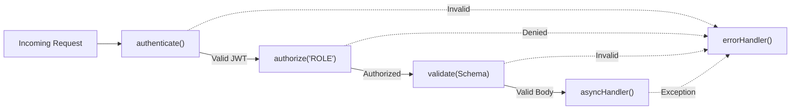

# @devsaini2300/backend-core

Production-ready backend infrastructure for Node.js/Express applications.

## Architecture



## Features

- 🔐 **JWT Authentication** — Generate and verify access/refresh tokens
- 🔑 **Password Hashing** — bcrypt-based secure password hashing
- 🛡️ **Middleware** — Authentication, authorization, validation, error handling
- ✅ **Validation** — Zod-based request validation with reusable schemas
- 📝 **Logging** — Pino structured logging
- 🎯 **Error Handling** — AppError class with global error handler
- 🔧 **Utilities** — asyncHandler, response helpers

## Installation

```bash
npm install @devsaini2300/backend-core
```

## Quick Start

```typescript
import {
  authenticate,
  authorize,
  validate,
  asyncHandler,
  sendSuccess,
  AppError,
  errorHandler,
  notFoundHandler,
  hashPassword,
  comparePassword,
  generateAccessToken,
  verifyAccessToken,
  createLogger,
} from "@devsaini2300/backend-core";

// Protect routes
router.get(
  "/profile",
  authenticate,
  asyncHandler(async (req, res) => {
    sendSuccess(res, { userId: req.user!.id });
  }),
);

// Role-based access
router.delete("/users/:id", authenticate, authorize("ADMIN"), deleteUser);

// Validation
router.post("/register", validate(registerSchema), registerController);

// Error handling
app.use(notFoundHandler);
app.use(errorHandler);
```

## API Reference

### Authentication

```typescript
// JWT
generateAccessToken(payload, secret, expiresIn?)
generateRefreshToken(payload, secret, expiresIn?)
verifyAccessToken(token, secret)
verifyRefreshToken(token, secret)

// Password
hashPassword(password)
comparePassword(password, hash)
```

### Middleware

```typescript
authenticate; // Reads JWT_ACCESS_SECRET from process.env
createAuthMiddleware(secret); // Factory with explicit secret
authorize(...roles); // Role-based authorization
validate(zodSchema); // Request body validation
errorHandler; // Global error handler
notFoundHandler; // 404 handler
```

### Utilities

```typescript
asyncHandler(fn)              // Async error wrapper
sendSuccess(res, data, status?)  // Success response
sendError(res, message, status?, code?, details?)  // Error response
createLogger(options?)        // Pino logger factory
```

### Errors

```typescript
new AppError(message, statusCode, code, details?)
AppError.badRequest(message)
AppError.unauthorized(message?)
AppError.forbidden(message?)
AppError.notFound(message?)
AppError.conflict(message)
AppError.tooManyRequests(message?)
AppError.internal(message?)
```

### Validation Schemas

```typescript
emailSchema; // Email validation + normalization
passwordSchema; // Min 8 chars, uppercase, lowercase, number, special char
nameSchema; // 2-100 chars, trimmed
uuidSchema; // UUID format
```

## License

MIT
